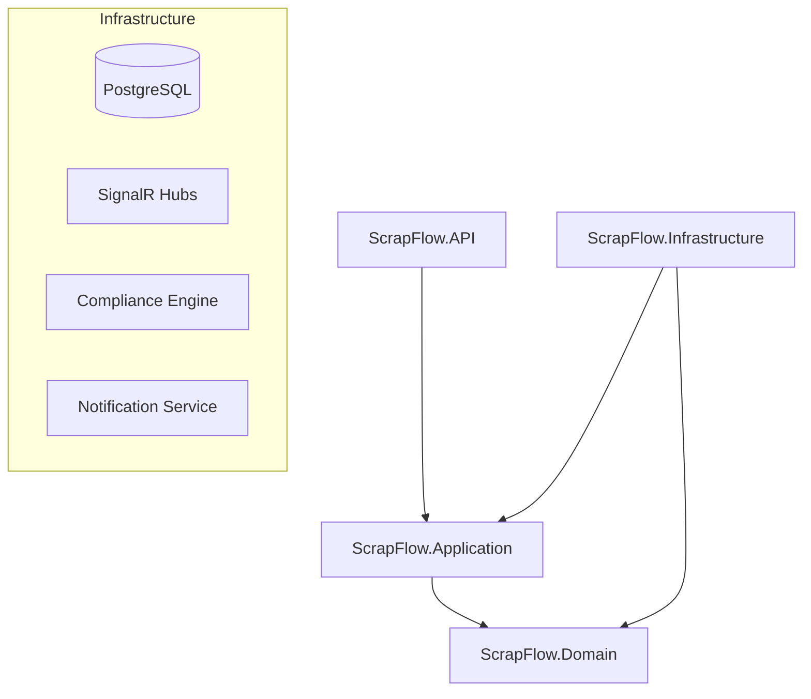

# ScrapFlow SA – Enterprise Scrapyard Management System

**ScrapFlow SA** is a full-stack, production-ready solution built specifically for the South African scrap metal industry. It modernizes the legacy "pen-and-paper" metal trade with a high-performance, **SAPS/ITAC-compliant** digital platform.

---

## 📽️ The Problem vs. The Solution

### The Problem

Legacy scrapyards in South Africa face three existential threats:

1.  **Compliance Chaos**: The _South African Second-Hand Goods Act_ and the recent **2024/2025 Metal Cash Ban** require strict record-keeping. Yards using paper registers often fail SAPS audits, leading to heavy fines or license revocation.
2.  **Operational Blindness**: Without real-time inventory tracking, owners are unaware of their exact tonnage on hand or their true profit margins after price fluctuations.
3.  **The Electronic Payment Gap**: Switching from cash to electronic payments (EFT) is a huge administrative burden without an integrated workflow to track proof-of-payments.

### The ScrapFlow Solution

ScrapFlow digitizes the entire lifecycle of a scrapyard transaction, ensuring that **compliance is baked into the code, not an afterthought.** By hard-blocking non-compliant actions (like missing ID photos or lacking EFT references), it acts as a "Digital Auditor" for the yard.

---

## 🌟 Key Features

### ⚖️ 1. Compliance-First Engine

- **Automatic Cash-Ban Enforcement**: The `TicketService` strictly prevents completion without valid EFT references.
- **Mandatory ID/Photo Capture**: Integrated Media API captures 3 mandatory photos (Seller, Load, ID) before a ticket can be finalized.
- **Audit-Ready Registers**: Rolling registers stored for 5 years as required by the Second-Hand Goods Act.

### 🍎 2. Premium Apple-Style UX

- **Aesthetic Engineering**: A minimalist, high-contrast UI designed for the harsh lighting conditions of a scrapyard. Built with glassmorphism and Tailwind's emerald palette.
- **Weighbridge Integration**: Direct communication with industrial scales via the **Web Serial API**.

---

## 🛠️ Engineering Challenges & Solves

Building a system for a highly regulated environment revealed several technical hurdles:

### 🔄 1. The Circular Dependency Trap

**Problem**: During the split between `Application` and `Infrastructure` layers, I encountered a circular dependency where services needed the `DbContext`, but the `DbContext` needed service-related logic.
**Solution**: I moved high-level business services (like `TicketService`) into the **Infrastructure layer**. By implementing interfaces defined in the `Application` layer, I maintained Clean Architecture principles while resolving the cyclic reference.

### 💉 2. Dependency Injection & Service Scoping

**Problem**: Standalone services (like the `NotificationService` for WhatsApp) initially threw runtime errors due to missing `ILogger` implementations and improper DI registrations.
**Solution**: I standardized DI registrations in `Program.cs` and utilized generic `ILogger<T>` patterns. In unit tests, I used **Moq** to provide verified mock loggers, ensuring the business logic could be tested in isolation from external logging providers.

### 🧪 3. In-Memory Database Versioning

**Problem**: When setting up the xUnit test suite, the latest `InMemoryDatabase` version (v10) was incompatible with the project's .NET 8 target.
**Solution**: I performed a manual downgrade to **Microsoft.EntityFrameworkCore.InMemory v8.0.0**, aligning the test infrastructure with the core runtime and ensuring stable "database-in-memory" testing for compliance rules.

---

## 🧠 What I Learnt

1.  **Industry-Specific Architecture**: Learnt how to translate legal requirements (SAPS/ITAC) into strict software "guards" and validation logic.
2.  **Browser-Hardware Interfacing**: Explored the power of the **Web Serial API** to bridge the gap between industrial hardware (scales) and modern web browsers.
3.  **Offline-First Resilience**: Implemented PWA strategies (Service Workers + IndexedDB) to ensure data integrity even when South African yard connectivity is unstable.
4.  **Clean Architecture Discipline**: Deepened my understanding of how to maintain strict separation of concerns even when complex infrastructure dependencies arise.

---

## 🏗️ Technical Architecture

---

## 🚀 Getting Started

1. **Docker Quick Start**: `docker-compose up --build`
2. **Backend**: `cd src/ScrapFlow.API && dotnet run`
3. **Frontend**: `cd scrapflow-client && npm run dev`
4. **Tests**: `dotnet test`

---

_Designed & Engineered for South African Scrapyards._
