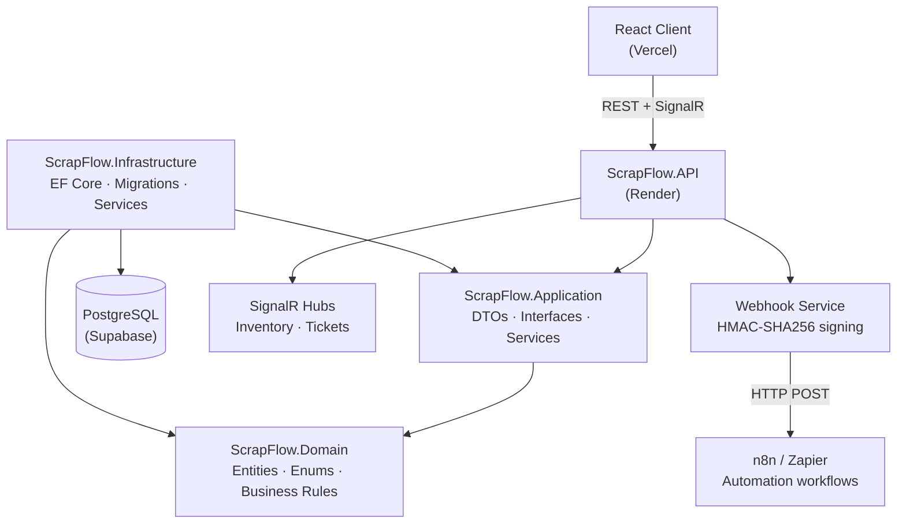

<div align="center">

# ScrapFlow SA

### The complete scrap metal management platform for South African scrapyards
### SAPS/ITAC compliant · Real-time · Multi-site · Production-ready

[](https://dotnet.microsoft.com/)
[](https://react.dev/)
[](https://www.postgresql.org/)
[](https://tailwindcss.com/)
[](https://www.docker.com/)
[](https://scrap-flow-xi.vercel.app/)
[](LICENSE)

<br/>

[Live Demo](https://scrap-flow-xi.vercel.app/) &nbsp;·&nbsp; [API Docs](https://scrapflow-api.onrender.com/swagger) &nbsp;·&nbsp; [Report Bug](https://github.com/dev-k99/ScrapFlow/issues)

</div>

---

> [!NOTE]
> **Try the live demo instantly — no sign-up needed.** Use any of the test accounts below:
>
> | Role | Email | Password |
> |------|-------|----------|
> | **Owner** *(full access)* | `owner@scrapflow.co.za` | `ScrapFlow@2026!` |
> | Manager | `manager@scrapflow.co.za` | `ScrapFlow@2026!` |
> | Scale Operator | `scale@scrapflow.co.za` | `ScrapFlow@2026!` |
> | Grader | `grader@scrapflow.co.za` | `ScrapFlow@2026!` |
> | Accountant | `accounts@scrapflow.co.za` | `ScrapFlow@2026!` |
>
> **Frontend**: https://scrap-flow-xi.vercel.app/ &nbsp;|&nbsp; **API**: https://scrapflow-api.onrender.com

---

## The Problem vs. The Solution

South African scrapyards face three existential threats from legacy pen-and-paper operations:

| Pain Point | Before ScrapFlow | After ScrapFlow |
|------------|-----------------|-----------------|
| **Compliance Chaos** | Paper registers fail SAPS audits → fines & license revocation | Compliance baked into code — ticket cannot complete without EFT ref + ID photos |
| **Operational Blindness** | No real-time tonnage or profit visibility | Live dashboard with inventory value, revenue, and ticket stats |
| **Cash Ban Burden** | Manual EFT tracking is error-prone and un-auditable | Integrated payment workflow with verified references and 5-year audit trail |

> The **South African Second-Hand Goods Act** and the **2024/2025 Metal Cash Ban** require strict digital record-keeping. ScrapFlow acts as a *Digital Auditor* — hard-blocking non-compliant actions at the service layer.

---

## Features

| Category | Feature | Detail |
|----------|---------|--------|
| **Compliance** | Cash-ban enforcement | Blocks ticket completion without a verified EFT reference |
| **Compliance** | Mandatory photo capture | 3 required photos: Seller ID, Load, Proof-of-Payment |
| **Compliance** | 5-year audit trail | Rolling registers stored per SAPS/ITAC requirements |
| **Operations** | 6-step inbound ticket | Arrive → Gross Weigh → Grade → Tare → Pay → Complete |
| **Operations** | Outbound tickets | Full customer invoice workflow with lot selection |
| **Inventory** | Real-time lot tracking | Automatic lot creation on ticket completion |
| **Inventory** | Adjust & write-off | Manager-approved lot adjustments with reason logging |
| **Real-time** | SignalR inventory hub | Live updates pushed to all connected clients instantly |
| **Automation** | Webhook system | Fires on ticket/inventory events → Zapier, n8n, Make |
| **UX** | Offline-first PWA | IndexedDB drafts survive connectivity loss |
| **UX** | Weighbridge integration | Web Serial API direct industrial scale communication |
| **Admin** | 5-role RBAC | Owner / Manager / ScaleOp / Grader / Accountant |
| **Admin** | Multi-site support | Manage multiple scrapyards from one account |
| **Reports** | Revenue & tonnage reports | Filterable by site, date range, and material grade |

---

## Tech Stack

| Backend | Frontend |
|---------|----------|
| ASP.NET Core 8 (Clean Architecture) | React 18 (JSX + Vite) |
| Entity Framework Core 8 | Tailwind CSS + Glassmorphism UI |
| PostgreSQL (Supabase) | Zustand state management |
| SignalR (real-time hubs) | @microsoft/signalr client |
| JWT authentication (12h tokens) | Axios + React Query patterns |
| HMAC-SHA256 webhook signing | Web Serial API (weighbridge) |
| Serilog structured logging | IndexedDB offline drafts |
| Docker + docker-compose | Deployed on Vercel |

---

## Architecture



---

## Deployment

| Layer | Platform | Notes |
|-------|----------|-------|
| **Frontend** | [Vercel](https://vercel.com/) | Auto-deploys on push to `main` |
| **Backend API** | [Render](https://render.com/) | Dockerized ASP.NET Core 8 |
| **Database** | [Supabase](https://supabase.com/) | Managed PostgreSQL |
| **Automation** | n8n (Docker) + Zapier | 4 pre-built workflow templates |

---

## Engineering Challenges & Solves

### 1. Circular Dependency in Clean Architecture
**Problem**: During the Application/Infrastructure split, services needed `DbContext` but `DbContext` needed service logic — a circular reference.
**Solution**: Moved `TicketService` into the Infrastructure layer, implementing interfaces defined in Application. Maintained Clean Architecture principles while resolving the cyclic reference.

### 2. Dependency Injection & Service Scoping
**Problem**: Standalone services threw runtime errors due to missing `ILogger` implementations and improper DI registrations.
**Solution**: Standardized all DI registrations in `Program.cs` using generic `ILogger<T>`. In unit tests, used **Moq** to provide verified mock loggers — isolating business logic from external providers.

### 3. In-Memory Database Versioning
**Problem**: The xUnit test suite failed because `InMemoryDatabase v10` was incompatible with the .NET 8 target.
**Solution**: Manual downgrade to `Microsoft.EntityFrameworkCore.InMemory v8.0.0`, aligning test infrastructure with the core runtime.

### 4. Non-Blocking Webhook Dispatch
**Problem**: Firing webhooks synchronously would add latency to every ticket completion HTTP response.
**Solution**: Implemented fire-and-forget using `_ = Task.Run(() => _webhookService.FireAsync(...))` — the HTTP response returns immediately while the webhook dispatches in the background. HMAC-SHA256 signature header ensures receiver authenticity.

---

## What I Learnt

1. **Industry-Specific Architecture** — Translating legal requirements (SAPS/ITAC) into strict software guards and validation logic at the service layer.
2. **Browser-Hardware Interfacing** — Using the **Web Serial API** to bridge industrial weighbridge hardware and modern web browsers without drivers.
3. **Offline-First Resilience** — PWA strategies with Service Workers + IndexedDB to handle South African connectivity instability.
4. **Clean Architecture Discipline** — Maintaining strict separation of concerns even when complex infrastructure dependencies arise in real-world projects.
5. **Real-time Systems** — Building SignalR hubs with group-based broadcasting (per-site) and stable client reconnection handling.

---

## Getting Started (Local Dev)

### Prerequisites
- .NET 8 SDK
- Node.js 18+
- Docker Desktop

### 1. Clone & configure
```bash
git clone https://github.com/dev-k99/ScrapFlow.git
cd ScrapFlow
cp src/ScrapFlow.API/appsettings.example.json src/ScrapFlow.API/appsettings.json
# Edit appsettings.json — add your PostgreSQL connection string and JWT secret
```

### 2. Docker quick start
```bash
docker compose up --build
# API: http://localhost:5010
# n8n: http://localhost:5678
```

### 3. Or run individually
```bash
# Backend
cd src/ScrapFlow.API && dotnet run

# Frontend
cd scrapflow-client && npm install && npm run dev
# → http://localhost:5173
```

### 4. Seed data
On first run, the API automatically seeds:
- 5 user accounts (Owner, Manager, ScaleOp, Grader, Accountant)
- 2 sites (Germiston Main Yard, Durban North Depot)
- 20 material grades (ferrous + non-ferrous) with realistic ZAR prices
- 10 suppliers + 3 customers + 5 sample completed tickets

---

## API Reference

| Resource | Method | Endpoint | Auth |
|----------|--------|----------|------|
| Auth | POST | `/api/auth/login` | Public |
| Auth | POST | `/api/auth/register` | Public |
| Dashboard | GET | `/api/dashboard?siteId=` | Any role |
| Inbound Tickets | POST | `/api/tickets/inbound` | ScaleOp+ |
| Inbound Tickets | PUT | `/api/tickets/inbound/{id}/gross-weight` | ScaleOp+ |
| Inbound Tickets | PUT | `/api/tickets/inbound/{id}/grading` | Grader+ |
| Inbound Tickets | PUT | `/api/tickets/inbound/{id}/payment` | Accountant+ |
| Inbound Tickets | PUT | `/api/tickets/inbound/{id}/complete` | Manager+ |
| Outbound Tickets | GET/POST | `/api/tickets/outbound` | ScaleOp+ |
| Inventory | GET | `/api/inventory?siteId=&status=` | Any role |
| Inventory | PUT | `/api/inventory/{id}/adjust` | Manager+ |
| Inventory | PUT | `/api/inventory/{id}/write-off` | Manager+ |
| Materials | GET | `/api/materials` | Any role |
| Suppliers | GET/POST | `/api/suppliers` | ScaleOp+ |
| Customers | GET/POST | `/api/customers` | ScaleOp+ |
| Reports | GET | `/api/reports` | Manager+ |
| Webhooks | GET/POST/DELETE | `/api/webhooks` | Owner only |
| Sites | GET/POST | `/api/sites` | Owner (POST) |
| Audit Log | GET | `/api/auditlogs` | Manager+ |
| Health | GET | `/health` | Public |


---

<div align="center">

**Designed & Engineered for South African Scrapyards**

*Built by [Kwanele Ntshangase](https://github.com/dev-k99) · [Live Demo](https://scrap-flow-xi.vercel.app/) · [View Source](https://github.com/dev-k99/ScrapFlow)*

</div>
